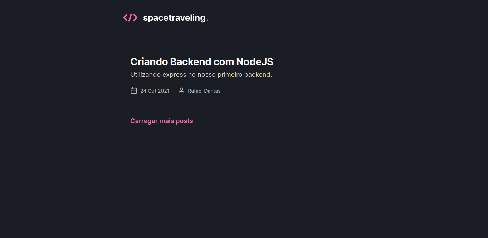
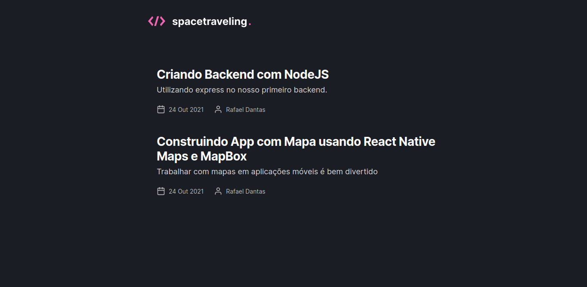
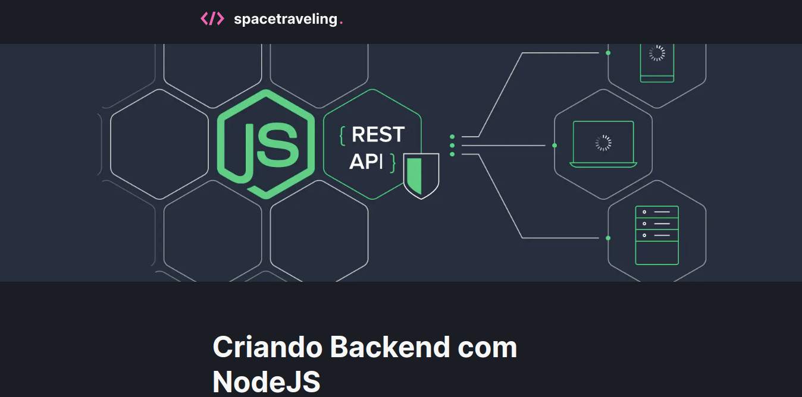
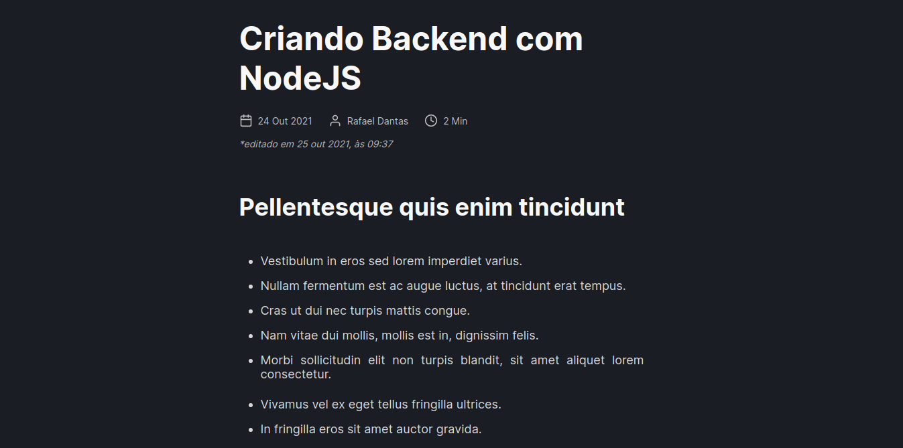

<p align="center">
   
</p>

> :rocket: Blog project , made with Nextjs


<div align="center">
  <sub>The Ignite project. Built with ❤︎ by
    <a href="https://github.com/Rafaeldsa">Rafael Dantas</a> and
    <a href="https://github.com/Rafaeldsa/Blog_NextJs/graphs/contributors">
      contributors
    </a>
  </sub>
</div>

# :pushpin: Table of Contents
 
* [Technologies](#computer-technologies)
* [Features](#rocket-features)
* [How to Run](#construction_worker-how-to-run)
* [Found a bug? Missing a specific feature?](#bug-issues)

### Web Screenshot
<div>
   
   
   
   
</div>

# :computer: Technologies
This project was made using the follow technologies:

* [Typescript](https://www.typescriptlang.org/)      
* [React](https://reactjs.org/)      
* [NextJs](https://nextjs.org/)       
* [Prismic CMS](https://prismic.io/)      

# :rocket: Features

* Comments.

# :construction_worker: How to run
```bash
# Clone Repository
$ git clone https://github.com/Rafaeldsa/Blog_NextJs.git
```
### 💻 Run Web Project

```bash
# Go to folder
$ cd Blog_NextJs

# Install Dependencies
$ yarn install

# Run Aplication
$ yarn dev
```
Access at http://localhost:3000/


# :bug: Issues

Feel free to **file a new issue** with a respective title and description on the the [Proffy](https://github.com/Rafaeldsa/Proffy/issues) repository. If you already found a solution to your problem, **i would love to review your pull request**!
